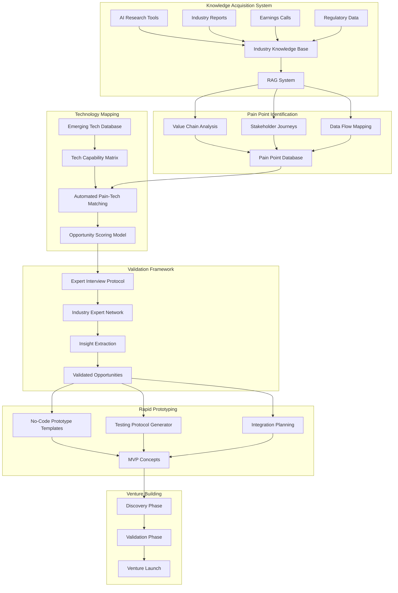

# startup-agent

```mermaid
flowchart TD
    subgraph "Knowledge Acquisition System"
        A1[AI Research Tools] --> B1[Industry Knowledge Base]
        A2[Industry Reports] --> B1
        A3[Earnings Calls] --> B1
        A4[Regulatory Data] --> B1
        B1 --> C1[RAG System]
    end
    
    subgraph "Pain Point Identification"
        C1 --> D1[Value Chain Analysis]
        C1 --> D2[Stakeholder Journeys]
        C1 --> D3[Data Flow Mapping]
        D1 & D2 & D3 --> E1[Pain Point Database]
    end
    
    subgraph "Technology Mapping"
        F1[Emerging Tech Database] --> G1[Tech Capability Matrix]
        G1 --> H1[Automated Pain-Tech Matching]
        E1 --> H1
        H1 --> I1[Opportunity Scoring Model]
    end
    
    subgraph "Validation Framework"
        I1 --> J1[Expert Interview Protocol]
        J1 --> K1[Industry Expert Network]
        K1 --> L1[Insight Extraction]
        L1 --> M1[Validated Opportunities]
    end
    
    subgraph "Rapid Prototyping"
        M1 --> N1[No-Code Prototype Templates]
        M1 --> N2[Testing Protocol Generator]
        M1 --> N3[Integration Planning]
        N1 & N2 & N3 --> O1[MVP Concepts]
    end
    
    subgraph "Venture Building"
        O1 --> P1[Discovery Phase]
        P1 --> P2[Validation Phase]
        P2 --> P3[Venture Launch]
    end

```