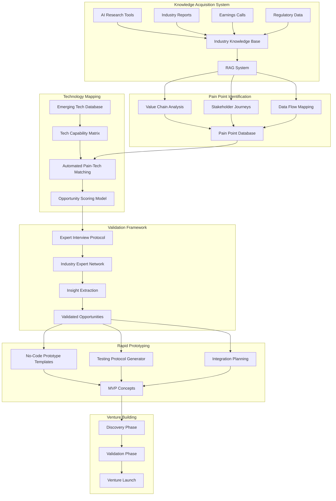

# Startup Agent

A comprehensive system for identifying, validating, and building technology ventures through AI-powered analysis and automation.

## System Architecture



## Software Components

### 1. Knowledge Acquisition System
- **AI Research Tools**
  - Web scraping and data collection pipeline
  - NLP processing for document analysis
  - API integrations for data sources
- **Industry Knowledge Base**
  - Vector database for semantic search
  - Document storage and versioning
  - Knowledge graph construction

### 2. Pain Point Identification
- **Value Chain Analysis**
  - Process mapping tools
  - Cost analysis algorithms
  - Efficiency metrics calculation
- **Stakeholder Journey Mapping**
  - User journey visualization
  - Pain point annotation system
  - Impact assessment tools

### 3. Technology Mapping
- **Tech Capability Matrix**
  - Technology classification system
  - Capability assessment framework
  - Integration compatibility checker
- **Pain-Tech Matching**
  - AI-powered matching algorithm
  - Solution feasibility calculator
  - Market fit analyzer

### 4. Validation Framework
- **Expert Network Management**
  - Expert profile database
  - Interview scheduling system
  - Feedback collection and analysis
- **Insight Extraction**
  - Sentiment analysis
  - Pattern recognition
  - Validation scoring system

### 5. Rapid Prototyping
- **No-Code Platform Integration**
  - Template management system
  - Component library
  - Deployment automation
- **Testing Framework**
  - User testing protocol generator
  - Feedback collection system
  - Performance metrics tracking

## Project Structure

```
startup-agent/
├── apps/
│   ├── knowledge-acquisition/     # Knowledge gathering and processing
│   ├── pain-point-analyzer/       # Pain point identification system
│   ├── tech-mapper/              # Technology mapping and matching
│   ├── validation-framework/      # Expert validation system
│   └── rapid-prototyping/        # Prototype generation tools
├── packages/
│   ├── shared-types/             # Common TypeScript types
│   ├── ui-components/            # Shared UI components
│   ├── api-client/               # API integration utilities
│   └── database/                 # Database schemas and migrations
├── infrastructure/
│   ├── terraform/                # Infrastructure as Code
│   ├── kubernetes/               # K8s configurations
│   └── monitoring/               # Monitoring and logging setup
└── docs/
    ├── architecture/             # System architecture documentation
    ├── api/                      # API documentation
    └── guides/                   # User and developer guides
```

## Technology Stack

- **Frontend**
  - Next.js for web applications
  - React for UI components
  - TailwindCSS for styling
  - TypeScript for type safety

- **Backend**
  - Node.js/Express for API services
  - Python for ML/AI components
  - PostgreSQL for relational data
  - Redis for caching
  - Elasticsearch for search
  - Neo4j for knowledge graph

- **Infrastructure**
  - Docker for containerization
  - Kubernetes for orchestration
  - AWS for cloud services
  - Terraform for IaC
  - GitHub Actions for CI/CD

## Setup Instructions

1. **Prerequisites**
   ```bash
   # Required tools
   - Node.js >= 18
   - Python >= 3.9
   - Docker
   - Kubernetes CLI
   - Terraform
   ```

2. **Local Development**
   ```bash
   # Clone the repository
   git clone https://github.com/your-org/startup-agent.git
   cd startup-agent

   # Install dependencies
   pnpm install

   # Start development environment
   pnpm dev
   ```

3. **Infrastructure Setup**
   ```bash
   # Initialize infrastructure
   cd infrastructure/terraform
   terraform init
   terraform apply
   ```

4. **Database Setup**
   ```bash
   # Run migrations
   pnpm db:migrate

   # Seed initial data
   pnpm db:seed
   ```

## Contributing

Please read our [Contributing Guide](CONTRIBUTING.md) for details on our code of conduct and the process for submitting pull requests.

## License

This project is licensed under the MIT License - see the [LICENSE](LICENSE) file for details.